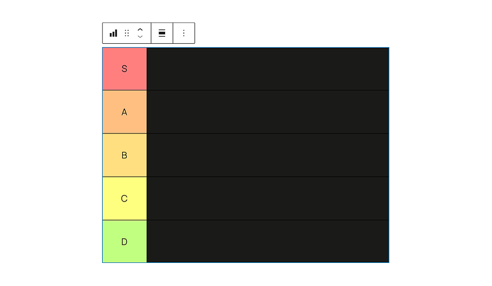

# Tier List Block



[](https://playground.wordpress.net/?blueprint-url=https://raw.githubusercontent.com/philhoyt/TierListBlock/main/_playground/blueprint.json)

A WordPress block plugin for creating TierMaker-style tier lists natively in the block editor.

## Blocks

The plugin registers four nested blocks:

| Block | Description |
|---|---|
| `tier-list/tier-list` | Outer wrapper — contains all tier rows |
| `tier-list/tier-item` | A single tier row |
| `tier-list/tier-label` | The rank label cell (S, A, B…) |
| `tier-list/tier-content` | The content zone for ranked items |

## Features

- Five pre-colored tier rows (S, A, B, C, D) inserted by default
- Add additional rows via the **Tiers** panel in the block sidebar
- Reorder rows with native Gutenberg block mover controls
- Customizable label background and text colors per row

## Installation

1. Go to the [Releases page](https://github.com/philhoyt/TierListBlock/releases) and download the `tier-list-block.zip` from the latest release assets.
2. In your WordPress admin, go to **Plugins → Add New Plugin → Upload Plugin**.
3. Choose the downloaded zip and click **Install Now**.
4. Click **Activate Plugin**.

## Requirements

- WordPress 6.6+
- PHP 7.4+

## Development

**Install dependencies**

```bash
npm install
composer install
```

**Start development build with watch**

```bash
npm start
```

**Production build**

```bash
npm run build
```

**Linting**

```bash
npm run lint:js
npm run lint:css
npm run lint:php
```

**Create plugin zip**

```bash
npm run plugin-zip
```

## License

GPL-2.0-or-later — see [LICENSE](https://www.gnu.org/licenses/gpl-2.0.html)
